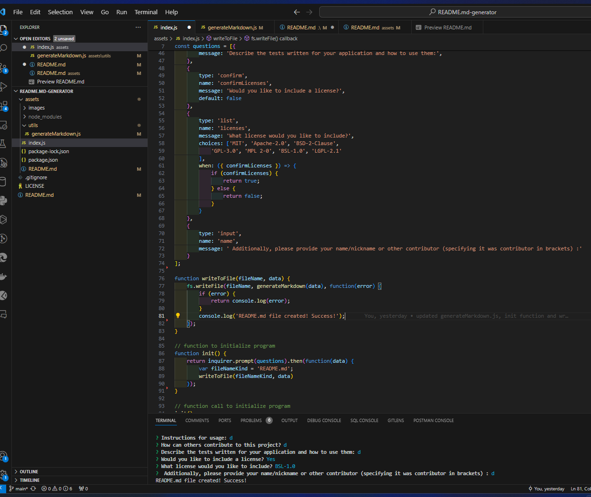

# < README.md-generator>

https://drive.google.com/file/d/1qcL3NMeo_SwYtRca9Z5asuXKNye_Tu6d/view?usp=sharing

## Description

Generates a Github readme file based on user input for it. It can be used to generate quickly a professional readme, so developers can focus more on working on their projects. 

## Table of Contents (Optional)

If your README is long, add a table of contents to make it easy for users to find what they need.
- [Description](#description)
- [Installation](#installation)
- [Usage](#usage)
- [Credits](#credits)
- [License](#license)
- [Features](#features)
- [Tests](#tests)

## Installation

Installation requirements:
Clone the repository on your local machine using git clone {paste code-local-SSH} ! 
Install Node.js in case you don't have it installed already!
Run `npm init` and install an inquirer version!

## Usage

After installing the required packages you should run the index.js script opening it in integrated terminal opening option and in the terminal witting 'node index'. Follow the prompted questions to enter information about your project! Once complete you should see a readme.md file just generated in the root folder of your project. 
Here is a code screenshot of the code and a test:

## Credits

This github repository : https://github.com/Andreea-Lita/README.md-generator
Other link: https://www.npmjs.com/package/inquirer/v/6.5.0

## License

MIT License
---
## Features

-Generates a README with essential sections like Description, Installation, Usage, License, Contributing, Tests, and Questions.
-Dynamically populates sections based on user input.
-Offers license selection with link for detailed information.
-Includes links in the Table of Contents for navigation.
